# Hệ thống chấm bài lập trình — Trường THCS Sông Lô

Giao diện cho một **online judge** phục vụ nội bộ Trường THCS Sông Lô (xã Tam Sơn, tỉnh Phú Thọ). Học sinh luyện tập và thi đấu môn Tin học bằng **C++**, bài nộp được chấm tự động theo bộ dữ liệu, có bộ dữ liệu ẩn và bảng xếp hạng.

> **Trạng thái: đã có backend.** Flask + SQLite, đăng nhập thật, phân quyền học sinh/giáo viên, hàng đợi bài nộp và một tiến trình chấm riêng dùng `g++` với giới hạn thời gian và bộ nhớ. Bộ dữ liệu mẫu trong `server/seed.py` là mã C++ thật và được chấm thật, nên mọi con số trên giao diện đều do bộ chấm sinh ra.
>
> Chưa xong, và đây là danh sách đầy đủ: quản lý kỳ thi (trang kỳ thi mới chỉ để xem), nhập danh sách tài khoản học sinh hàng loạt, xuất bảng điểm, và trang đổi mật khẩu ở lần đăng nhập đầu (cột `must_change_password` đã có trong CSDL nhưng chưa có trang).

## Ảnh chụp

| Trang chủ | Danh sách đề |
|---|---|
| 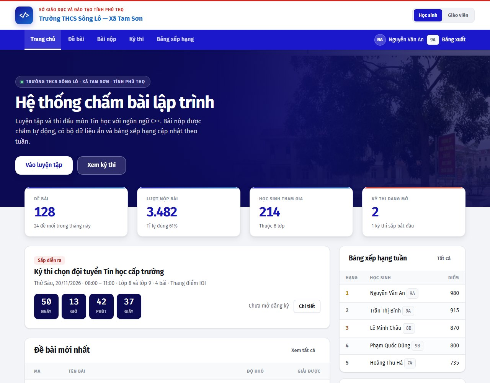 | 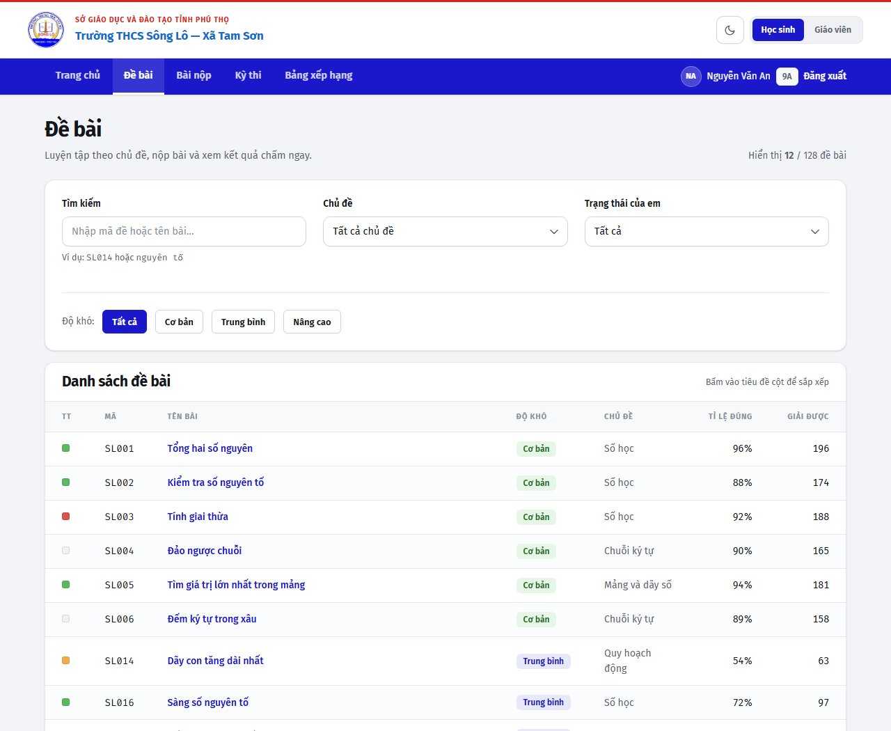 |

| Nộp bài (có tô màu cú pháp) | Bảng xếp hạng |
|---|---|
| 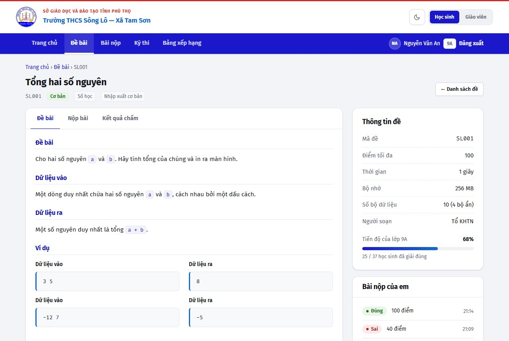 | 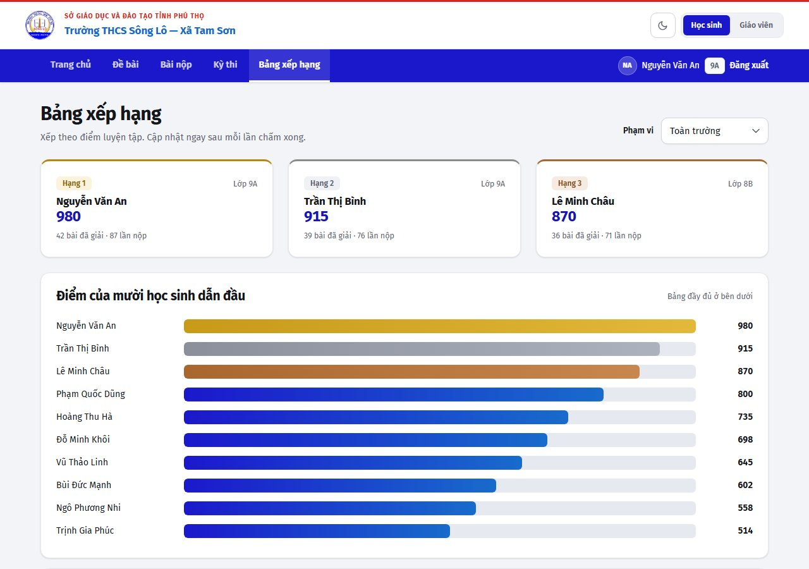 |

| Tổng quan giáo viên | Danh sách bài nộp |
|---|---|
| 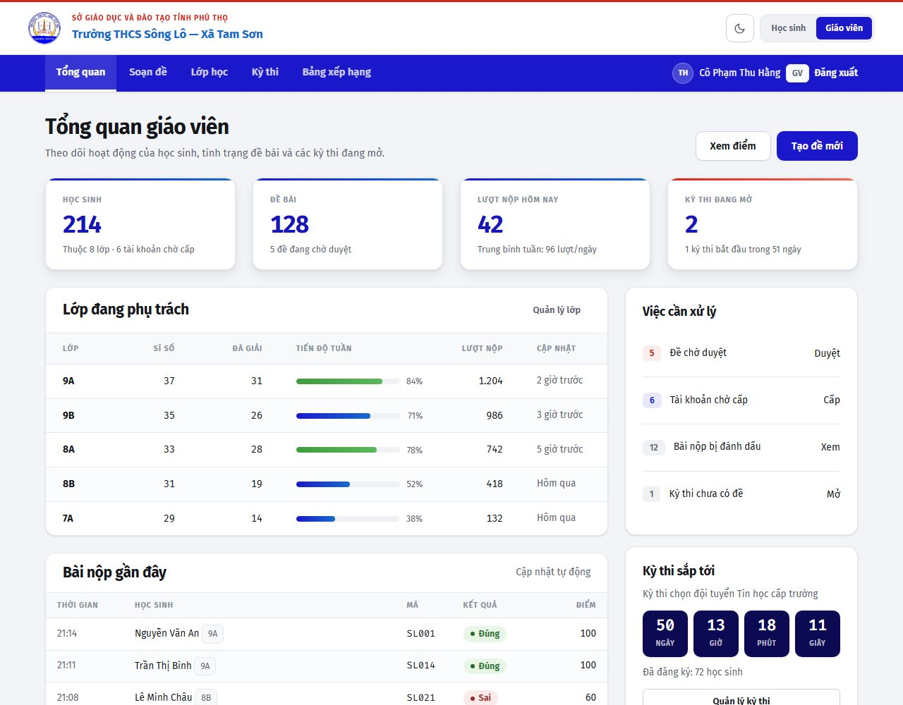 | 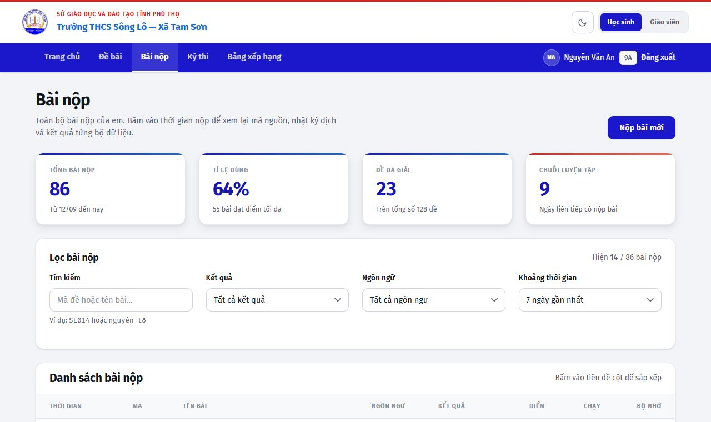 |

| Chi tiết một bài nộp | Chế độ tối |
|---|---|
| 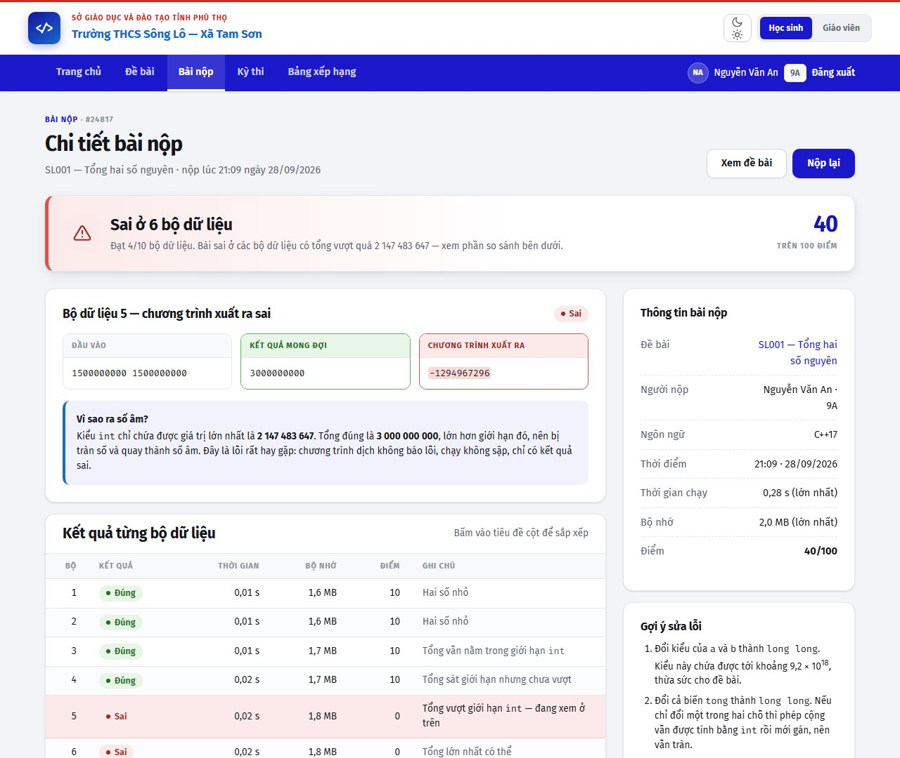 | 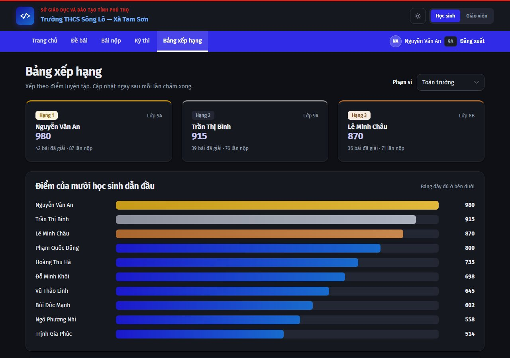 |

Các trang của giáo viên — đăng nhập bằng `cophang / Songlo@GV2026`:

| Soạn đề | Bộ dữ liệu của một đề |
|---|---|
| 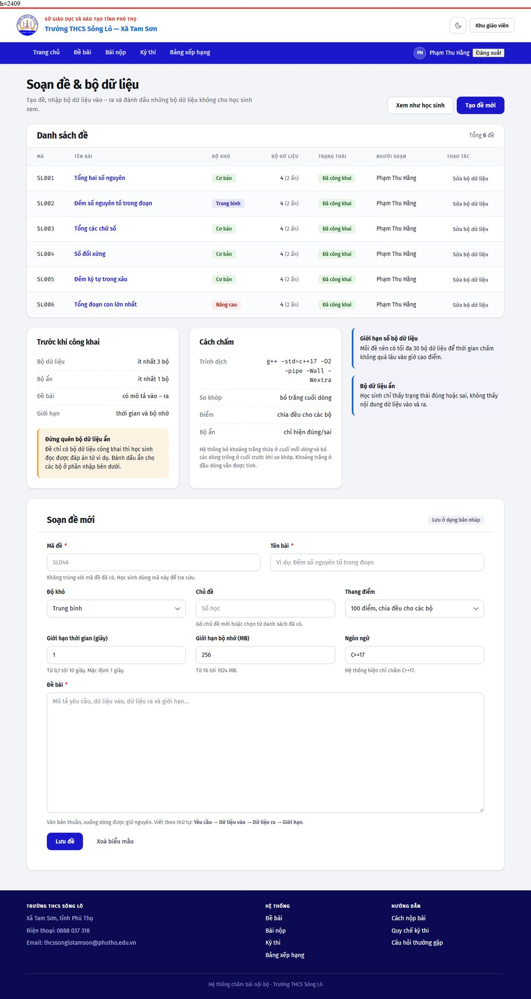 | 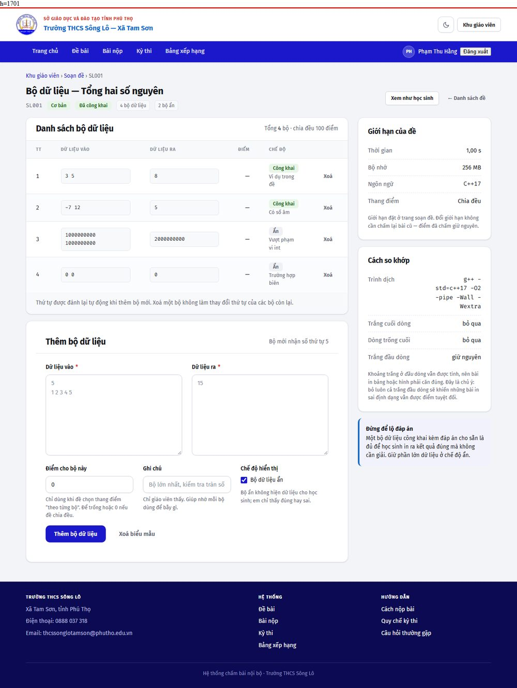 |

| Lớp học & điểm | Chi tiết bài nộp quá bộ nhớ (chế độ tối) |
|---|---|
| 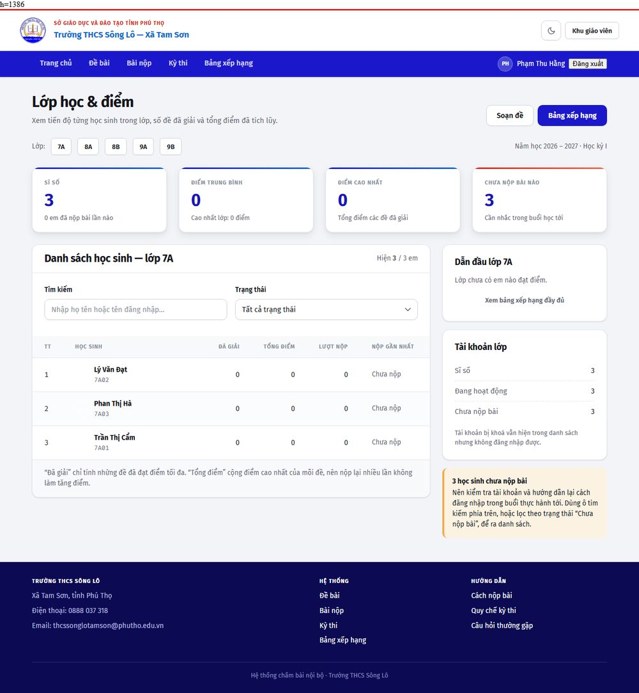 | 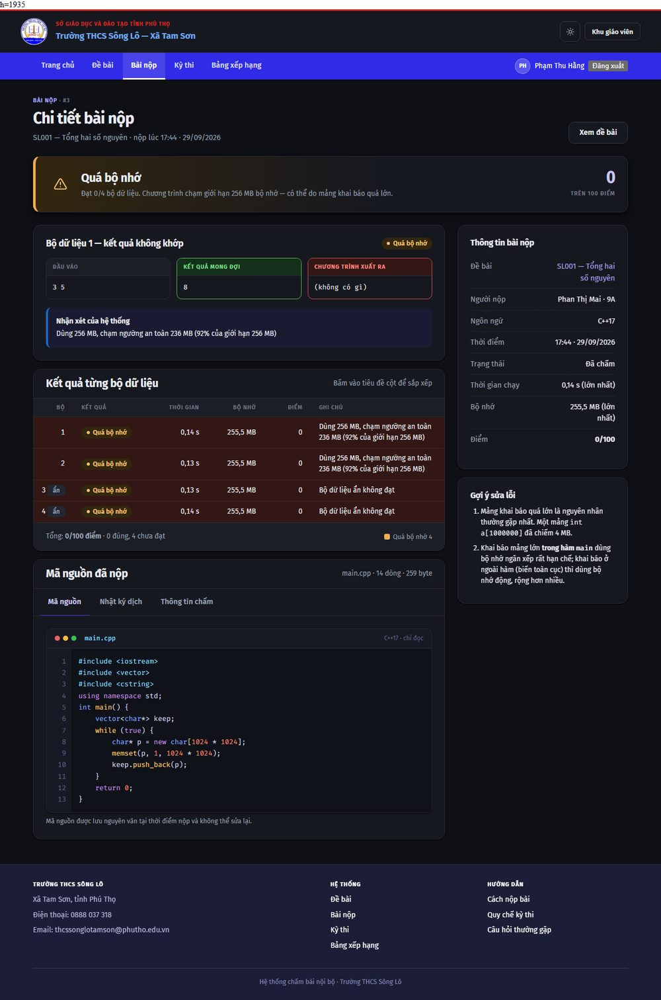 |

| Sửa đề — nơi công khai đề cho học sinh |
|---|
| 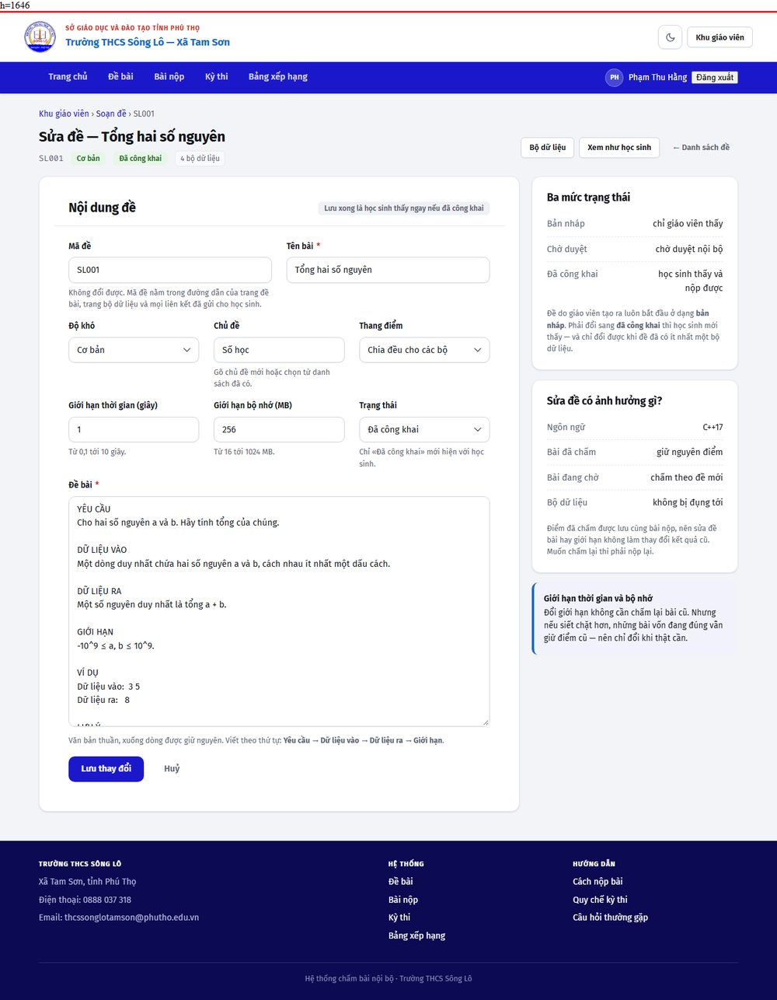 |

## Chạy thử

### Bản demo giao diện (tĩnh, không cần cài gì)

Cần chạy qua HTTP, không mở trực tiếp bằng `file://` — trình duyệt sẽ chặn tải phông chữ do CORS:

```bash
cd demo
python -m http.server 8777
```

Rồi mở `http://127.0.0.1:8777/`.

Không có bước build. Không dùng framework. CSS và JS đều là file tĩnh.

### Hệ thống thật (Flask + SQLite + tiến trình chấm riêng)

Cần Python 3.11 trở lên và `g++` có trong `PATH`.

```bash
python -m venv .venv && . .venv/bin/activate     # Windows: .venv\Scripts\activate
pip install -r server/requirements.txt

python -m server.seed                            # tạo tài khoản, đề, bộ dữ liệu, kỳ thi
python -m server.worker --once                   # chấm các bài nộp mẫu
python -m server.app                             # mở http://127.0.0.1:5000
```

`server.seed` in ra tài khoản để đăng nhập. Mật khẩu mặc định chỉ để chạy thử —
phải đổi trước khi đưa lên máy chủ trường.

Hai tiến trình, chạy song song khi dùng thật:

| Tiến trình | Việc |
|---|---|
| `python -m server.app` | Trả trang web |
| `python -m server.worker` | Nhận bài nộp từ hàng đợi và chấm |

Trong lúc phát triển, `server.seed` và `server.worker` chạy được trên Windows.
Phần chấm bài trên Windows chỉ có trần thời gian thực, không có giới hạn CPU và
không hạ được quyền — xem `deploy/README.md` để biết vì sao máy chủ thật phải là Linux.

### Kiểm tra

```bash
python tests/test_teacher.py       # quyền giáo viên, nhập ZIP, công khai đề, sinh dữ liệu
python tests/test_account.py       # tài khoản, đổi mật khẩu, migration CSDL
node   tests/test_tex.js           # chuyển LaTeX sang HTML
python _tools/smoke.py             # mở thử mọi tuyến đường, bắt lỗi template
python _tools/test_edit_problem.py # kiểm thử chức năng sửa đề (trên bản sao CSDL)
python _tools/test_paths.py        # ba tiến trình có suy ra cùng một CSDL không
python _tools/test_judge_isolation.py  # thư mục chấm có dùng được từ tài khoản hạ quyền không
python _tools/render_pages.py      # render các trang cần đăng nhập ra demo/_render/
python _tools/shoot.py --url http://127.0.0.1:8814 --theme light   # chụp ảnh từng trang
node _tools/check_morph.js _shots/dom_*.html                       # tên morph có trùng không
```

Ba bộ trong `tests/` chạy trên **CSDL tạm và thư mục chấm tạm**, tự dọn sau khi
chạy, nên không đụng tới dữ liệu thật. Chúng chạy được ở cả Windows lẫn Linux —
điều này có chủ ý, vì phần lớn lỗi thật của hệ thống chỉ hiện ra trên một trong
hai nền tảng: hạ quyền tiến trình con, đường dẫn `main.exe`, mã hoá tên tệp.

`test_teacher.py` là bộ lớn nhất (195 điều) và đáng chú ý nhất ở phần **sinh bộ
dữ liệu từ lời giải mẫu**: đây là chỗ duy nhất hệ thống **dịch và chạy chương
trình do giáo viên gửi lên**. Ngoài đường đi đúng, nó kiểm cả sáu đường sai —
bộ sinh không dịch được, bộ sinh không in gì, bộ sinh treo, lời giải mẫu thoát
lỗi, thiếu một trong hai chương trình, mã nguồn quá dài — và đòi mỗi đường phải
trả về một câu đọc được, không phải trang 500 và không phải im lặng. Nó cũng
chạy **hai lần cùng một bộ sinh** để chứng minh cùng chỉ số bộ thì ra cùng dữ
liệu, vì mất tính chất đó thì không sinh lại được đúng bộ cũ khi cần đối chiếu.

`test_tex.js` chạy được bằng `node` mà không cần trình duyệt: nó nạp chính
`demo/assets/js/app.js` mà trang thật dùng, nên không có chuyện bộ kiểm và mã
chạy thật lệch nhau.

`test_edit_problem.py` **sao chép CSDL ra tệp tạm** trước khi làm việc, vì nó ghi
chứ không chỉ đọc: nó tạo đề, sửa đề và công khai đề. Chạy thẳng trên CSDL thật
thì mỗi lần kiểm thử lại để lại rác. Nó kiểm 33 điều, trong đó có những điều
không thể chứng minh bằng cách đọc mã — rằng lưu thất bại thì CSDL không đổi và
biểu mẫu giữ nguyên chữ đã gõ, rằng giá trị lạ trong ô chọn bị thay bằng mặc định
chứ không lọt vào CSDL, và rằng công khai một đề chưa có bộ dữ liệu thì bị chặn.

`test_paths.py` tồn tại vì một lỗi đã thật sự xảy ra lúc dựng trên máy chủ Linux.
`app.py` và `worker.py` suy ra đường dẫn CSDL từ `SONGLO_VAR`, còn `seed.py` ghi
cứng `server/var/songlo.db`. Làm đúng theo `deploy/README.md` — nơi `SONGLO_VAR`
trỏ tới `/var/lib/songlo` — thì lệnh seed tạo CSDL **trong cây mã nguồn**, còn
tiến trình web mở một CSDL khác, rỗng, không lược đồ, không tài khoản. Không bộ
kiểm tra nào đang có bắt được, vì mọi script khác đều chạy mà không đặt
`SONGLO_VAR` — và khi đó cả ba đường lại trùng nhau. Script này đặt biến rồi chạy
thật cả ba, và kiểm cả rằng `server/var/` không bị đụng tới.

`test_judge_isolation.py` tồn tại vì một lỗi thứ hai cũng chỉ xảy ra trên máy chủ
Linux, và lần này triệu chứng trỏ thẳng vào bài làm của học sinh. `mkdtemp` tạo
thư mục làm việc với quyền 0700 thuộc `root`; tiến trình con bị hạ xuống
`SONGLO_JUDGE_RUNAS_UID` trước khi `exec` nên không có quyền **tìm kiếm** trên
thư mục đó, và `g++` báo `cc1plus: fatal error: main.cpp: Permission denied` —
nằm lẫn trong nhật ký dịch, cùng chỗ với lỗi cú pháp. Kết quả: **mọi** bài nộp đều
CE, kể cả bài đúng, và không bài nào chạy được một bộ dữ liệu nào. Trên Windows
không tái hiện được vì không có `setuid`; script này vì thế chỉ chạy đủ bốn phần
khi là POSIX **và** đang là root, còn lại thì báo bỏ qua chứ không im lặng coi như
đạt. Phần 2 còn kiểm ngược lại rằng thư mục 0700 của root **không** dùng được —
một phép kiểm luôn xanh thì không chứng minh được gì.

`render_pages.py` tồn tại vì `chrome --headless --screenshot` không đăng nhập được:
các trang của giáo viên — đúng những trang nhiều cột nhất, dễ tràn ngang nhất —
không có cách nào xem thử bằng ảnh chụp. Nó đăng nhập bằng `test_client` rồi ghi
HTML đã render vào `demo/_render/`; đặt trong `demo/` là có chủ ý, vì template gọi
tài sản tĩnh bằng đường dẫn tuyệt đối `/assets/...`.

`shoot.py` đo chiều cao thật của trang trước rồi mới chụp, và đi qua một iframe
ghi `localStorage` trước khi tải trang — Chrome headless theo chế độ sáng/tối của
hệ điều hành chứ không theo cờ dòng lệnh, nên nếu không ép thì ảnh "chế độ sáng"
sẽ ra chế độ tối mà không có dấu hiệu nào trong lệnh.

## Các trang

Nhóm **học sinh**:

| Tệp | Nội dung |
|---|---|
| `index.html` | Trang chủ — số liệu, kỳ thi gần nhất có đếm ngược theo giai đoạn, đề mới, bảng xếp hạng, bài nộp gần đây |
| `problems.html` | Danh sách đề — tìm kiếm, lọc theo độ khó và chủ đề, bảng sắp xếp được, phân trang |
| `problem.html` | Chi tiết đề + nộp bài — 3 thẻ: Đề bài / Nộp bài / Kết quả chấm |
| `submissions.html` | Danh sách bài nộp — lọc theo kết quả, ngôn ngữ, khoảng thời gian |
| `submission.html` | Chi tiết một lần nộp — kết luận, so sánh ở bộ dữ liệu chưa đạt, kết quả từng bộ, mã nguồn, nhật ký dịch |
| `contests.html` | Kỳ thi — đang diễn ra, sắp diễn ra, đã kết thúc |
| `leaderboard.html` | Bảng xếp hạng — top 3, biểu đồ cột ngang, bảng đầy đủ |
| `login.html` | Đăng nhập — có minh hoạ báo lỗi theo chuẩn trợ năng |

Nhóm **giáo viên** (bấm nút chuyển vai trò ở góc trên bên phải):

| Tệp | Nội dung |
|---|---|
| `teacher.html` | Tổng quan — tiến độ từng lớp, bài nộp gần đây, việc cần xử lý |
| `teacher-problems.html` | Soạn đề — danh sách đề, biểu mẫu tạo đề, quản lý bộ dữ liệu kể cả bộ ẩn |
| `teacher-problem-edit.html` | Sửa một đề — đề bài, giới hạn, độ khó, chủ đề và **trạng thái công khai**. Đây là chỗ duy nhất đổi được `status`, nên cũng là chỗ duy nhất công khai được một đề |
| `teacher-classes.html` | Lớp học & điểm — sổ điểm từng lớp, lọc theo tên và trạng thái. Chưa cấp tài khoản hàng loạt và chưa xuất được bảng điểm ra tệp |

Liên kết sâu tới từng thẻ hoạt động được, ví dụ `problem.html#panel-submit` mở thẳng phần nộp bài.

## Cấu trúc

```
.
├── demo/                     Bản demo giao diện (mở thư mục này để xem)
│   ├── *.html                11 trang tĩnh, dữ liệu viết cứng
│   ├── _render/              HTML của backend do `_tools/render_pages.py` sinh ra (không vào repo)
│   └── assets/               CSS/JS dùng chung với hệ thống thật
│       ├── css/style.css     Toàn bộ hệ thống thiết kế (token + thành phần)
│       ├── js/app.js         Tương tác, không phụ thuộc thư viện ngoài
│       └── img/              logo.png (huy hiệu, nền trong suốt) · hero.jpg
├── server/                   Hệ thống thật
│   ├── app.py                Tuyến đường và các trang
│   ├── auth.py               Đăng nhập, phân quyền, chống CSRF
│   ├── db.py                 SQLite, quy ước thời gian UTC
│   ├── schema.sql            Lược đồ CSDL
│   ├── sandbox.py            Chạy mã học sinh với giới hạn tài nguyên
│   ├── judge.py              Dịch, so khớp kết quả, tính điểm
│   ├── gendata.py            Sinh bộ dữ liệu từ bộ sinh + lời giải mẫu
│   ├── worker.py             Tiến trình chấm, tách khỏi tiến trình web
│   ├── seed.py               Dữ liệu mẫu (kèm bài nộp C++ thật để chấm thử)
│   ├── formatting.py         Định dạng số, ngày, nhãn tiếng Việt
│   └── templates/            15 template Jinja
├── tests/                    Bộ kiểm thử chạy được ở mọi máy (xem “Kiểm tra”)
│   ├── test_teacher.py       195 điều: quyền giáo viên, nhập ZIP, công khai đề, sinh dữ liệu
│   ├── test_account.py       55 điều: tài khoản, đổi mật khẩu, migration CSDL
│   ├── test_tex.js           56 điều: chuyển LaTeX sang HTML
│   └── _dump_tex.js          In HTML của một tài liệu .tex thật (để đối chiếu)
├── deploy/                   Hướng dẫn dựng trên máy chủ Linux
├── _tools/                   Script kiểm tra và sinh ảnh chụp
│   ├── smoke.py              Mở thử 46 tuyến đường theo ba vai trò
│   ├── test_edit_problem.py  Kiểm thử chức năng sửa đề, trên bản sao CSDL
│   ├── test_paths.py         Ba tiến trình có suy ra cùng một đường dẫn CSDL không
│   ├── test_judge_isolation.py  Thư mục chấm có dùng được từ tài khoản hạ quyền không
│   ├── render_pages.py       Render các trang cần đăng nhập ra HTML tĩnh
│   ├── shoot.py              Chụp ảnh từng trang (đo chiều cao trước khi chụp)
│   └── check_morph.js        Kiểm tra tên morph trên DOM đã render
├── docs/                     Ảnh chụp cho README, ghi chú nguồn đề (nguon-de.md)
├── assets/                   Ảnh gốc tải từ website nhà trường (kể cả huy hiệu)
├── research/                 Ghi chú khảo sát DMOJ/VNOJ
│   ├── dmoj_install.md
│   ├── dmoj_settings.py
│   └── judge_config.md
└── bao-cao-dmoj-tinh-gon.html   Báo cáo: đánh giá DMOJ, phương án tinh gọn, lộ trình
```

## Kiến trúc backend, và một quyết định cần xác nhận

**Phần backend này viết mới, không dựa trên DMOJ.** Đây là chỗ lệch so với báo cáo
`bao-cao-dmoj-tinh-gon.html`, nên cần nói rõ để quyết định lại nếu muốn.

Báo cáo kết luận nên dùng **VNOJ** (bản fork tiếng Việt của DMOJ) và ghi rõ một
ràng buộc: DMOJ bắt buộc MariaDB + Redis + Celery + nginx + uWSGI + supervisor.
Cắt tính năng bằng cấu hình thì được, nhưng **không cắt được tầng dữ liệu và các
dịch vụ phụ trợ** — đó là ràng buộc cứng của kiến trúc. Một trường THCS chỉ cần
C++ và vài lớp học, nhưng vẫn phải vận hành sáu dịch vụ.

Phương án ở đây thay vào đó là một ứng dụng Flask tự chứa:

| Chọn | Thay vì | Vì sao |
|---|---|---|
| Flask | Django | Chỉ cần tuyến đường và template. Django mang theo ORM, admin, migration — ba thứ không dùng tới. |
| SQLite (thư viện chuẩn) | MariaDB / PostgreSQL | Quy mô một trường: vài trăm tài khoản, vài nghìn bài nộp. Sao lưu bằng cách copy một tệp. |
| Hàng đợi là các dòng `pending` trong CSDL | Redis + Celery | Hàng đợi chỉ cần "bài nào chưa chấm". `BEGIN IMMEDIATE` bảo đảm hai tiến trình chấm không giành nhau một bài. |
| `g++` trực tiếp + `setrlimit` | Docker cho mỗi bài | Không cần image, không cần quyền root cho Docker, chấm nhanh hơn nhiều. Đổi lại: cách ly yếu hơn, bù bằng hạ quyền và giới hạn tài nguyên. |
| C++17 | 60+ ngôn ngữ | Đúng nhu cầu của trường. |

**Đánh đổi phải biết:**

- Cách ly mã học sinh **yếu hơn Docker**. Bù lại bằng `RLIMIT_AS`/`RLIMIT_CPU`/`RLIMIT_NPROC`,
  `setsid`, chặn tệp core, và tuỳ chọn hạ quyền xuống `nobody`. Không có cách ly
  hệ thống tệp: nếu worker chạy bằng tài khoản có quyền ghi, mã học sinh cũng có.
  Trên máy chủ thật **phải** chạy worker bằng tài khoản riêng ít quyền.
- Không có hệ sinh thái của DMOJ: không plugin, không bảng xếp hạng Elo, không
  nhập đề từ các hệ thống khác, không cộng đồng hỗ trợ.
- Đổi lại: cài đặt gọn hơn nhiều, đọc hiểu được toàn bộ mã nguồn, và chấm nhanh
  hơn vì không có lớp Docker.

Nếu sau này cần nhiều ngôn ngữ, thi đấu liên trường, hoặc tính điểm xếp hạng thì
VNOJ sẽ phù hợp hơn. Còn với phạm vi "một trường, một ngôn ngữ, vài lớp học" thì
phương án này nhẹ hơn và ít thứ có thể hỏng hơn.

## Hệ thống thiết kế

Phong cách **Swiss grid + product UI**: lưới rõ ràng, tương phản cao, đổ bóng thật để tạo chiều sâu, thang chữ dứt khoát. Phù hợp công cụ dữ liệu dày đặc.

Bảng màu lấy từ chính website nhà trường, đã lọc bỏ màu mặc định của Bootstrap:

| Vai trò | Mã màu | Nguồn |
|---|---|---|
| Chính | `#1B18CC` | Thanh menu trang trường |
| Phụ | `#186BCC` | Dòng tên trường |
| Nhấn | `#DA251E` | Màu đỏ cờ ở dòng cơ quan chủ quản |
| Nền | `#F3F4F7` | Nền trang |
| Chữ | `#14161C` | Nội dung |

Màu kết quả chấm bài dùng đúng bộ màu Bootstrap mà trang trường đang dùng:

| Kết quả | Màu |
|---|---|
| Đúng (AC) | `#5CB85C` |
| Sai (WA) | `#D9534F` |
| Quá thời gian / bộ nhớ (TLE/MLE) | `#F0AD4E` |
| Lỗi khi chạy (RTE) | `#7F77DD` |
| Lỗi dịch (CE) | `#888780` |
| Đang chấm | `#186BCC` |

Phông: **Fira Sans** cho giao diện, **Fira Code** cho mã nguồn. Đang tải từ Google Fonts — nếu triển khai trong mạng nội bộ không có Internet, cần tải về đặt cùng máy chủ và sửa `@font-face`.

### Chế độ tối

Có sẵn chế độ tối, đổi bằng nút ở góc trên bên phải. Lần đầu truy cập thì theo cài đặt hệ điều hành; sau khi người dùng tự chọn thì lựa chọn được nhớ lại.

Toàn bộ phần này chỉ chiếm một khối `html[data-theme="dark"]` khoảng 45 dòng, vì mọi thành phần đều tham chiếu token ngữ nghĩa (`--bg`, `--surface`, `--fg`, `--border`, `--link`, `--ink`, `--fill`, màu kết quả…) chứ không dùng mã màu trực tiếp. Đoạn script đổi chế độ nằm trong `<head>` và chạy trước lần vẽ đầu tiên nên không bị nháy trắng khi tải trang.

### Về logo nhà trường

Biểu trưng ở góc trên bên trái là **huy hiệu chính thức của Trường THCS Sông Lô**. Tệp gốc lưu ở `assets/school-logo.png`; bản dùng trong giao diện là `demo/assets/img/logo.png`, đã xoá nền trắng thành trong suốt nên cùng một tệp hiển thị được trên cả nền sáng lẫn nền tối, không cần thêm nền phía sau và không cần biến thể riêng cho từng chế độ.

Cách xoá nền: ảnh gốc là hình vuông có huy hiệu tròn nội tiếp, bốn góc là nền trắng phẳng. Tô loang từ bốn góc xoá đúng phần nằm ngoài vòng tròn — đo được **21,2%**, sát con số lý thuyết 21,5% (diện tích hình vuông trừ đường tròn nội tiếp) — và không đụng tới các vùng trắng bên trong huy hiệu. Nền trắng còn lại *bên trong* vòng tròn là một phần thiết kế của huy hiệu, không phải sót lại — nên ở chế độ tối huy hiệu hiện ra như một huy hiệu tròn nền sáng, chứ không phải hình trong suốt.

Kích thước hiển thị là **52×52 px**, không phải 46 px như bản đầu: huy hiệu có một vòng chữ nhỏ bao quanh, dưới khoảng 50 px thì vòng chữ đó nhoè thành một vệt. Ảnh gốc rộng 144 px nên vẫn dư độ phân giải cho màn hình mật độ cao. Con số này phải khớp ở hai chỗ: `width`/`height` trong `.site-head__mark` (CSS) và thuộc tính `width`/`height` trên thẻ `` ở cả 11 trang. CSS thắng sau khi tải xong, nhưng thuộc tính giữ đúng kích thước chỗ đó ngay từ đầu nên không bị nhảy bố cục lúc mới tải.

Ảnh chụp sân trường tải từ website nhà trường chỉ còn dùng làm **nền mờ cho khối hero** ở trang chủ (`demo/assets/img/hero.jpg`) — đã cắt ở vùng không có chữ và phủ lớp màu đậm nên chỉ còn là một mảng tối có vân, không phải ảnh minh hoạ. Một mục "Cơ sở vật chất" riêng từng có trên trang chủ đã được bỏ: nó giới thiệu khuôn viên nhà trường, không liên quan tới việc chấm bài.

## Điểm đáng chú ý về kỹ thuật

- **Tô màu cú pháp C++ không cần thư viện.** `app.js` có một bộ tách từ bằng một biểu thức chính quy duy nhất, chạy trên lớp `<pre>` nằm dưới một `textarea` trong suốt chữ. Con trỏ và vùng chọn vẫn là của trình duyệt. Nếu JS lỗi, lớp tô màu không được bật và mã nguồn vẫn đọc được bình thường.
- **Ô soạn thảo tự giãn theo nội dung**, tối thiểu 210 px, tối đa 620 px rồi mới cuộn.
- **Trợ năng:** liên kết bỏ qua điều hướng, vòng tiêu điểm rõ ràng, vùng chạm tối thiểu 44×44 px, `aria-sort` cho cột sắp xếp, tóm tắt lỗi biểu mẫu nhận tiêu điểm, thẻ dùng `role="tab"` và điều hướng bằng phím mũi tên, tôn trọng `prefers-reduced-motion`.
- **Không tràn ngang ở 390 px** trên cả 16 trang, kể cả các trang giáo viên nhiều cột (đã đo bằng script trên trình duyệt thật, không phải ước lượng).
- **Trang chi tiết bài nộp** giải thích được lỗi cụ thể: bộ dữ liệu 5 có `1500000000 1500000000`, kết quả đúng là `3000000000` nhưng chương trình in ra `-1294967296` — tràn số `int`. Đây là lỗi dịch không báo, chạy không sập, chỉ sai kết quả.

Về bộ chấm:

- **Đo bộ nhớ bằng `os.wait4`, không phải `subprocess`.** `subprocess` không trả về `rusage`, nên không biết được đỉnh bộ nhớ thật của tiến trình con. Đổi lại phải nhớ một điều: **không được** gọi `Popen.wait()`/`poll()`/`communicate()` trên tiến trình đó, vì chúng thu hồi tiến trình trước và `os.wait4` sẽ ném `ChildProcessError`.
- **Xét bộ nhớ trước khi xét mã thoát.** Một chương trình C++ hết bộ nhớ chết bằng `SIGABRT` (nếu dùng `new`) hoặc `SIGSEGV` (nếu dùng `malloc` trả `NULL`). Nếu xét mã thoát trước thì nó bị xếp nhầm thành "lỗi khi chạy", trong khi nguyên nhân thật là dùng quá nhiều bộ nhớ.
- **Hai cơ chế chặn quá thời gian, không phải một.** `RLIMIT_CPU` chặn vòng lặp tính toán; đồng hồ canh giờ thực chặn chương trình ngủ hoặc chờ đọc dữ liệu vào — loại tiêu tốn ít CPU nhưng treo cả hàng đợi chấm. Bộ bài nộp mẫu trong `server/seed.py` có cả hai loại, để nếu ai xoá một trong hai cơ chế thì có bài kiểm tra phát hiện ra.
- **Bộ dữ liệu ẩn được giấu ở tầng dữ liệu, không phải tầng hiển thị.** Ba cột `input_seen`/`expected_seen`/`actual_seen` trong `test_results` để trống với bộ ẩn, nên một lỗi ở template cũng không có gì để làm lộ.
- **Bảng xếp hạng cộng điểm cao nhất của từng đề, không cộng mọi lần nộp.** Nếu cộng tất cả thì nộp lại nhiều lần sẽ tự tăng điểm, và bảng xếp hạng đo số lần bấm nút chứ không đo năng lực.
- **Bằng điểm thì ai đạt trước xếp trên.** Trước đây tiêu chí phân định cuối cùng là **tên học sinh**, nghĩa là thứ tự alphabet quyết định hạng — sáu em cùng 100 điểm nhận sáu hạng khác nhau mà không có căn cứ nào, và trông như lỗi. Nay thứ tự là: điểm → số đề giải trọn vẹn → thời điểm đạt điểm sớm nhất → tên (chỉ còn là chốt chặn cuối cho trường hợp hoàn toàn giống nhau). Hạng tính kiểu thi đấu (1-2-2-4) nên đồng hạng thật thì cùng số. Quy tắc này được ghi ngay trên giao diện, vì học sinh không nhìn thấy thời điểm đạt điểm ở đâu cả.
- **Một câu thông báo không được mâu thuẫn với con số ngay cạnh nó.** Bộ chấm xếp "quá bộ nhớ" ngay từ 92% giới hạn (`MEMORY_PRESSURE_RATIO`), vì đỉnh RSS đo được luôn thấp hơn giới hạn một chút. Nhưng câu thông báo cũ vẫn nói "vượt giới hạn 256 MB" — trong khi ngay cạnh nó ghi "Dùng 255,5 MB". Con số đúng, lý do sai, và người đọc kết luận bộ chấm có lỗi. Nay dải 92–100% được mô tả là "chạm ngưỡng an toàn 236 MB (92% của giới hạn 256 MB)".

Về chuyển cảnh:

- **Hiệu ứng morph kiểu PowerPoint** giữa các trang, dùng View Transitions API. Phần tử mang `data-morph` trùng tên ở hai trang (mã đề, tên học sinh, huy hiệu kết quả) được trình duyệt nội suy vị trí và kích thước; phần còn lại mờ đi. Trình duyệt chưa hỗ trợ thì có dự phòng bằng FLIP đọc vị trí cũ từ `sessionStorage`. Tôn trọng `prefers-reduced-motion`.
- **Một tên morph chỉ được xuất hiện một lần trong một trang.** Nếu trùng, trình duyệt huỷ **toàn bộ** hiệu ứng của cả trang chứ không chỉ bỏ qua phần tử trùng, và chỉ ghi một dòng vào console. `app.js` có bộ chặn, `_tools/check_morph.js` kiểm tra lại trên DOM đã render. Bảng xếp hạng là chỗ từng mắc lỗi này: cùng một học sinh vừa ở thẻ top 3 vừa ở bảng đầy đủ.

Về vòng soạn đề:

- **Trạng thái công khai từng là một đường cụt.** `_create_problem` luôn ghi `status = 'draft'`, và không có chỗ nào trong toàn bộ mã nguồn ghi lại cột `status`. Trang danh sách đề lọc `status = 'live'`, nên một đề do giáo viên tạo ra **không bao giờ** hiện với học sinh, và thẻ "Đề chờ duyệt" trên trang tổng quan đếm một trạng thái mà không đường nào chạm tới. Trang sửa đề tồn tại chủ yếu để bịt lỗ này; nó cũng là chỗ sửa được đề bài và giới hạn.
- **Không công khai được một đề chưa có bộ dữ liệu.** Nếu cho phép, học sinh vẫn nộp bài nhưng bộ chấm không có gì để chạy nên mọi bài đều ra "lỗi hệ thống chấm" — và lỗi ấy trông như hệ thống hỏng, chứ không như đề thiếu dữ liệu. Chốt chặn nằm ở `_update_problem`, và trang sửa đề cũng cảnh báo sẵn từ trước.
- **Mã đề cố ý không sửa được.** Nó nằm trong đường dẫn của ba trang khác nhau, nên đổi mã là làm hỏng mọi liên kết đã chia sẻ cho học sinh. Muốn mã khác thì tạo đề mới.
- **Giá trị trong ô chọn đi qua whitelist, không lấy thẳng từ biểu mẫu.** `difficulty` và `points_mode` quyết định tên lớp CSS và được tra trong `DIFFICULTY_LABEL`; một giá trị lạ lọt vào CSDL sẽ hiện ra mã thô (`co-ban2`) ở chỗ đáng lẽ là nhãn tiếng Việt.
- **Lưu thất bại thì hiện lại đúng những gì giáo viên vừa gõ**, không phải bản cũ trong CSDL. Mất cả một đề dài vì một ô còn thiếu là lý do người ta bỏ luôn trang này.

Về việc sinh bộ dữ liệu từ lời giải mẫu:

- **Ngân sách thời gian 20 giây là do gunicorn quyết định, không phải do chọn tuỳ ý.** Dịch vụ chạy với thời hạn mặc định 30 giây, và một yêu cầu vượt quá nó bị cắt với lỗi 502 — giáo viên mất công chờ rồi nhận một trang lỗi, và không biết đã sinh được bao nhiêu. Dừng ở 20 giây, giữ lại những bộ đã sinh, và nói rõ đã dừng ở đâu thì hơn hẳn. Con số này nằm ở `TOTAL_BUDGET_MS`, và nó phải được xem lại nếu ai đổi thời hạn của gunicorn.
- **Hai thư mục làm việc riêng cho bộ sinh và lời giải mẫu.** `judge.compile_source` luôn ghi mã nguồn thành `main.cpp` trong thư mục nó nhận và tạo tệp chạy tên `main`; dùng chung một thư mục thì chương trình thứ hai ghi đè chương trình thứ nhất.
- **Bộ sinh nhận chỉ số bộ qua `argv[1]`, không qua stdin.** Nó không có dữ liệu vào — nó *tạo* dữ liệu. Nhận chỉ số là để viết được `srand(atoi(argv[1]))`: cùng chỉ số thì ra cùng dữ liệu, nên sinh lại được đúng bộ cũ khi cần đối chiếu. Bộ kiểm thử chạy hai lần cùng một bộ sinh và so từng byte để chốt tính chất này.
- **Sinh được một phần vẫn ghi phần đó vào.** Bỏ đi thì giáo viên mất công chờ mà không được gì; im lặng trả về phần thiếu thì họ tưởng đề đã đủ dữ liệu — đúng kiểu lỗi im lặng cần tránh. Nên hàm trả về **cả** danh sách bộ đã sinh **lẫn** thông báo lỗi, và tuyến đường ghi cả hai.
- **Sáu đường sai đều phải trả về một câu đọc được**: bộ sinh không dịch được, không in gì, treo, lời giải mẫu thoát lỗi, thiếu một trong hai chương trình, mã nguồn quá dài. Trường hợp "bộ sinh không in gì" là trường hợp dễ bị bỏ qua nhất — nó *chạy thành công* và tạo ra một bộ dữ liệu vào rỗng, và với dữ liệu vào rỗng thì mọi bài nộp đều đúng.
- **Trần 256 KB cho một tệp dữ liệu không phải vì CSDL.** Đề cấp 2 không chạm tới con số đó, nhưng một bộ sinh viết nhầm (`while (true) cout << i;`) thì chạm rất nhanh, và mỗi byte lọt vào là một byte nằm trong CSDL vĩnh viễn.

Về cách trình bày dữ liệu thời gian và cờ trình dịch:

- **`vn_range` là filter riêng cho khoảng thời gian.** Mẫu cũ là `{{ starts_at|vn_date_long }} – {{ ends_at|vn_time }}`; `vn_date_long` đã kèm cả giờ nên kỳ thi 23/09 → 03/10 hiện thành "Thứ Tư, 23/09/2026 · 19:44 – 19:44", đọc như kỳ thi dài 0 phút vì **ngày kết thúc biến mất**. Lỗi này nằm ở cả ba trang (trang chủ, kỳ thi, tổng quan giáo viên) vì cùng một mẫu được chép tay ba lần.
- **Cờ trình dịch lấy từ `COMPILE_FLAGS` của `judge.py`, không ghi cứng trong template.** Hai trang từng ghi cứng `g++ -std=c++17 -O2` trong khi bộ chấm thật chạy thêm `-pipe -Wall -Wextra`. Cờ hiển thị mà lệch với cờ thật thì giáo viên đang đọc một thứ không đúng.
- **`app.js` được cả bản demo tĩnh lẫn backend thật dùng chung** (Flask trỏ `static_folder` vào `demo/assets`). Khối `initSubmit` của bản demo chặn sự kiện mặc định, nên nó chỉ chạy khi biểu mẫu **không có** `action` — nếu không, một mẫu template thật lỡ mang `data-submit-form` sẽ khiến học sinh bấm "Nộp bài" mà không có gì được gửi đi, im lặng và không báo lỗi.
- **`<select>` cắt chữ mà không để lại dấu vết nào.** Ô chọn gốc của trình duyệt cắt phần chữ vượt bề rộng, không thêm dấu ba chấm, không có gợi ý khi trỏ vào, và `scrollWidth` của `<select>` **luôn bằng** `clientWidth` nên phép so đó không phát hiện được gì. Hai ô trên trang sửa đề từng hiện "100 điểm, chia đều cho c…" và "Đã công khai — học sinh …". Cách kiểm tra đúng là đo chữ bằng chính phông của ô chọn rồi so với bề rộng khả dụng:
  ```js
  var cs = getComputedStyle(sel);
  var span = document.createElement('span');
  span.style.cssText = 'position:absolute;visibility:hidden;white-space:nowrap;font:' + cs.font;
  span.textContent = sel.options[sel.selectedIndex].textContent.trim();
  document.body.appendChild(span);
  var need = span.getBoundingClientRect().width;   // so với clientWidth - padding
  ```
  Cách chữa rẻ nhất là **viết nhãn ngắn lại và đưa phần giải thích xuống dòng gợi ý bên dưới** — không phải nới rộng ô, vì bề rộng do lưới bố cục quyết định.

## Bước tiếp theo

Đã xong:

1. Giao diện 11 trang tĩnh + 14 template Jinja cho hệ thống thật, có chế độ tối,
   đã đo không tràn ngang ở 390 px trên cả 16 trang.
2. Backend Flask + SQLite: tài khoản và phân quyền, đề bài và bộ dữ liệu ẩn,
   bảng xếp hạng, kỳ thi có đếm ngược, tiến trình chấm riêng. Vòng soạn đề đã
   khép kín: tạo đề → thêm bộ dữ liệu → sửa đề → công khai.
3. Bộ chấm đã chạy thật qua cả sáu loại kết quả: AC, WA, TLE, MLE, RE, CE.
4. Giáo viên toàn quyền trên giao diện: quản lý tài khoản (tạo, sửa, đặt lại mật
   khẩu, khoá, xoá), tạo và sửa kỳ thi, gán đề vào kỳ thi, sửa và xoá đề. Nhập
   bộ dữ liệu từ tệp ZIP kiểu Themis. Đổi mật khẩu ở lần đăng nhập đầu. Công
   khai đề bằng một bấm, và nhập bộ dữ liệu xong thì đề tự được công khai.
5. **Sinh bộ dữ liệu từ lời giải mẫu.** Giáo viên dán vào hai chương trình C++ —
   một bộ sinh tạo dữ liệu vào, một lời giải mẫu tạo đáp án — và hệ thống ghép
   thành N bộ dữ liệu hoàn chỉnh. Đây là thứ biến một đề lấy từ kho (LQDOJ, Tin
   học trẻ, đề HSG các tỉnh) thành một đề chấm được trong vài phút, vì các kho
   đó cho đề bài nhưng **không** cho dữ liệu chấm. Xem `docs/nguon-de.md`.
6. Đã dựng trên máy chủ Linux của trường: <https://oj.sarsed.eu.cc>

Còn lại:

1. Chốt giao diện với giáo viên, sửa những chỗ chưa hợp ý.
2. Việc chưa làm, đã biết — xếp theo mức độ cản trở công việc thật:
   1. **Xuất bảng điểm** ra tệp để nộp sổ điểm.
   2. **Nhập đề kèm cả đề bài lẫn dữ liệu trong một tệp.** Hiện tệp ZIP chỉ mang
      bộ dữ liệu; đề bài phải dán riêng.
   3. **Nhập tài khoản học sinh từ tệp danh sách lớp.** Hiện tạo được từng em
      một; một lớp thật có thể hơn 40 em, nhập tay là không khả thi.
   4. **Trang "Nguồn đề" trong khu giáo viên**, để giáo viên khác trong trường
      đọc được mà không cần mở repo này.
   5. **Sinh đề tự động từ lời giải mẫu**: hiện bộ sinh phải viết tay. Một bước
      xa hơn là đọc giới hạn trong đề bài (``n ≤ 10^5``) rồi tự chọn kích thước
      bộ dữ liệu — nhưng đọc hiểu đề bài tiếng Việt là bài toán khác hẳn, và
      làm ẩu ở đây sẽ sinh ra bộ dữ liệu trông hợp lệ mà không kiểm được gì.

Xem `docs/nguon-de.md` để biết lấy đề bài và dữ liệu chấm từ đâu.

## Ghi chú về giấy phép

Phần mã trong repo này là giao diện và backend viết mới, không chứa mã nguồn DMOJ.

Kế hoạch triển khai dựa trên **DMOJ** / **VNOJ**, cả hai đều theo giấy phép **AGPL-3.0**. Nếu lấy mã của họ vào, repo phải giữ giấy phép AGPL-3.0 và công khai toàn bộ mã nguồn phía máy chủ. Điều này cần cân nhắc trước khi triển khai chính thức.
